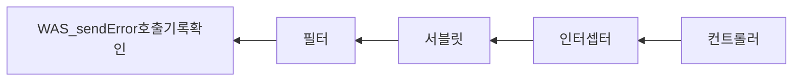

# springMvc2_Exception
스프링 MVC2편 - 백엔드 웹 개발 활용 기술 예외처리와 오류페이지

## 예외처리와 오류페이지

아래처럼 프로젝트를 생성하고 시작해보쟈아


----

## 1. 서블릿 예외 처리 

서블릿은 다음 2가지 방식으로 예외 처리를 지원한다.

- Exception
- response.sendError(HTTP 상태코드, 오류메시지)


```java
@Slf4j
@Controller
public class ServletController {

  @GetMapping("/error-ex")
  public void errorEx(){
    throw new RuntimeException("예외 발생!");
  }

  @GetMapping("/error-404")
  public void error404(HttpServletResponse response) throws IOException {
    response.sendError(404, "404 오류");
  }

  @GetMapping("/error-500")
  public void error500(HttpServletResponse response) throws IOException {
    response.sendError(500);
  }
}
```


<br><br>요청 흐름은 다음과 같다.



**response.sendError()**를 호출하면 response내부에는 오류가 발생했다는 상태를 저장해둔다.<br>그리고 고객에게 응답 전에 response에 sendError()가 호출되었는지 확인한다<br>호출되었다면 설정한 오류코드에 맞추어 기본 오류페이지를 보여준다.

----

## 서블릿 예외 오류 페이지 만들기

과거에는 **web.xml**아래와같이 설정하여 오류 화면을 등록했다.

```xml
 <web-app>
      <error-page>
        <error-code>404</error-code>
        <location>/error-page/404.html</location>
      </error-page>
      <error-page>
        <error-code>500</error-code>
        <location>/error-page/500.html</location>
      </error-page>
      <error-page>
        <exception-type>java.lang.RuntimeException</exception-type>
        <location>/error-page/500.html</location>
      </error-page>
</web-app>
```

<br>

그러나 지금은 **스프링부트**에서 제공해주는 기능을 사용해 **서블릿 오류 페이지**를 **등록**하면 된다.

첫번째, **WebServerFactoryCustomizer**을 상속받은 WebServerCustomizer클래스를 @Component로 등록한 후<br>ErrorPage(상태코드, requestUrl)를 등록해준다. <br>requestUrl은 해당 상태코드가 발생할 경우 해당 URL로 이동시켜 ErrorPage에 닿게 하는 역할을한다.

```java
@Component
public class WebServerCustomizer implements WebServerFactoryCustomizer<ConfigurableWebServerFactory> {
    @Override
    public void customize(ConfigurableWebServerFactory factory) {
        // errorPage 생성
        ErrorPage errorPage404 = new ErrorPage(HttpStatus.NOT_FOUND, "/error-page/404");
        ErrorPage errorPage500 = new ErrorPage(HttpStatus.INTERNAL_SERVER_ERROR, "/error-page/500");
        ErrorPage errorPageEx = new ErrorPage(RuntimeException.class, "/error-page/500");

        factory.addErrorPages(errorPage404, errorPage500, errorPageEx);
    }
}
```

- HttpStatus.NOT_FOUND
- HttpStatus.INTERNAL_SERVER_ERROR
- RuntimeException.class

<br>

해당 흐름은 아래와 같다.

```java
1. WAS(여기까지 전파) <- 필터 <- 서블릿 <- 인터셉터 <- 컨트롤러(예외발생)
2. WAS `/error-page/404` 다시 요청 -> 필터 -> 서블릿 -> 인터셉터 -> 컨트롤러(/error- page/404) -> View
```

> 클라이언트는 한번 요청하였는데 Controller에서 error가 발생하면 <br>**WAS까지 전파**되어 **예외 처리하는 오류 페이지를 확인**한다.<br>오류페이지가 있음을 확인하고 "**/error-page/404**" **URL을 한번 더 요청**하므로<br>결과적으로 서버 내부적으로는 **요청이 2번** 나간다.


아래는 **1번 오류를 발생시키는 Controller**이다

```java
public class ServletController {
  @GetMapping("/error-ex")
  public void errorEx(){
    throw new RuntimeException("예외 발생!"); // error MSG 등록
  }

  @GetMapping("/error-404")
  public void error404(HttpServletResponse response) throws IOException {
    response.sendError(404, "404 오류"); // error MSG 등록
  }

  @GetMapping("/error-500")
  public void error500(HttpServletResponse response) throws IOException {
    response.sendError(500);
  }
}
```


또한 2번 **오류페이지로 이동하는 Controller**에서는 **오류 정보**를 아래과 같이 담을 수 있다.

```java
@Slf4j
@Controller
public class ErrorPageController {
    //RequestDispatcher 상수로 정의되어 있음
    public static final String ERROR_EXCEPTION = "javax.servlet.error.exception";
    public static final String ERROR_EXCEPTION_TYPE = "javax.servlet.error.exception_type";
    public static final String ERROR_MESSAGE = "javax.servlet.error.message";
    public static final String ERROR_REQUEST_URI = "javax.servlet.error.request_uri";
    public static final String ERROR_SERVLET_NAME = "javax.servlet.error.servlet_name";
    public static final String ERROR_STATUS_CODE = "javax.servlet.error.status_code";

    @RequestMapping("/error-page/404")
    public String errorPage404(HttpServletRequest request, HttpServletResponse response){
        log.info("errorPage 404");
        printErrorInto(request);
        return "/error-page/404";
    }

    @RequestMapping("/error-page/500")
    public String errorPage500(HttpServletRequest request, HttpServletResponse response){
        log.info("errorPage 500");
        printErrorInto(request);
        return "/error-page/500";
    }

    private void printErrorInto(HttpServletRequest request){
        log.info("ERROR_EXCEPTION: {}", request.getAttribute(ERROR_EXCEPTION));
        log.info("ERROR_EXCEPTION_TYPE: {}", request.getAttribute(ERROR_EXCEPTION_TYPE));
        log.info("ERROR_MESSAGE: {}", request.getAttribute(ERROR_MESSAGE));
        log.info("ERROR_REQUEST_URI: {}", request.getAttribute(ERROR_REQUEST_URI));
        log.info("ERROR_SERVLET_NAME: {}", request.getAttribute(ERROR_SERVLET_NAME));
        log.info("ERROR_STATUS_CODE: {}", request.getAttribute(ERROR_STATUS_CODE));
    }
}
```

| ERROR_EXCEPTION<br>예외           | ERROR_EXCEPTION_TYPE<br>예외 타입      | ERROR_MESSAGE<br>오류 메시지                                 | ERROR_REQUEST_URI<br>클라이언트 요청 URL | ERROR_SERVLET_NAME<br>오류가 발생한 서블릿 이름 | ERROR_STATUS_CODE<br>HTTP 상태코드  |
| --------------------------------- | -------------------------------------- | ------------------------------------------------------------ | ---------------------------------------- | ----------------------------------------------- | ----------------------------------- |
| javax.servlet.error<br>.exception | javax.servlet.error<br>.exception_type | javax.servlet.error<br>.message                              | javax.servlet.error<br>.request_uri      | javax.servlet.error<br>.servlet_name            | javax.servlet.error<br>.status_code |
| {}                                | class java.lang.RuntimeException       | Request processing failed; nested exception is java.lang.RuntimeException: 예외 발생! | /error-ex                                | dispatcherServlet                               | 500                                 |
| null                              | null                                   | 404 오류                                                     | /error-404                               | dispatcherServlet                               | 404                                 |
| null                              | null                                   |                                                              | /error-500                               | dispatcherServlet                               | 500                                 |

위 오류들은 모두 **DispatcherType**을 찍으면 **ERROR**가 나온다

-----

## DispatcherType / 서블릿 예외 처리 (인터셉터, 필터)

예외가 발생할 경우  WAS까지 전달되면서 필터와 인터셉터를 한번씩 더 타게 됩니다. <br>이 경우를 방지하기 위해 **클라이언트 요청**인지, 아니면 **오류페이지를 출력하기위한 요청**인지 **구분**할 수 있어야합니다

```java
request.getDispatcherType(); // Dispatcher 타입 불러오기
```

```java
public enum DispatcherType {	
      REQUEST,	// 클라이언트 요청
      ERROR,    // 오류 요청
      FORWARD,  // 서블릿에서 다른 서블릿이나 JSP를 호출 
  							// (RequestDispatcher.forward(request, response);)
      INCLUDE,  // 서블릿에서 다른 서블릿이나 JSP의 결과를 포함
  							// RequestDispatcher.include(request, response);
      ASYNC,		// 서블릿 비동기 호출
}
```


## 필터로 DispatcherType을 적용해보자 

### 첫번째 DispatcherType(REQUEST, ERROR) 둘다 적용하기

 
```java
filterFilterRegistrationBean.setDispatcherTypes(DispatcherType.REQUEST, DispatcherType.ERROR);
```


<br><br>만약, **DispatcherTypes**를 **주석**처리할 경우 기본값이 **DispatcherType.REQUEST**하나만 설정된다

그리고 ErrorPage를 실행하면 **/error/ex**만 Filter를 타고 <br>**/error-page/500**은 Filter를 타지 않는다

 <Br>500Error를 WAS까지 타게되고
**500 상태코드**가 떨어지고
당연히 WebServerCustomizer에 설정한 오류페이지로는 이동 하게된다.


<br><br>Filter에서 아래처럼 controller에서 발생된 오류를 <br> try catch로 error를 잡고 <br>throw e로 WAS까지 던졌다.

```java
try {
  chain.doFilter(request, response);
} catch (Exception e) {
  throw e; // WAS까지 Exception 던지기
} finally {
}
```

<br><br>그런데 **throw e**를 주석처리하게 되면 어떻게 될까?

```java
try {
  chain.doFilter(request, response);
} catch (Exception e) {
  //throw e; // WAS까지 Exception 못던짐
} finally {
}
```

WAS까지 Exception이 안던져지고 잡았기에 **/error-page/500**이라는 URL로 이동을 못할것이고 <br>그럼 오류페이지로 이동은 못하게된다.

500Error를 WAS까지 못탔고 
**200 상태코드**가 떨어지고
당연히 WebServerCustomizer에 설정한 오류페이지로는 이동 못하게된다.


----

### 인터셉터에도 적용해본다면

```java
@Slf4j
public class LogInterceptor implements HandlerInterceptor {
    public static final String LOG_ID = "logId";
    @Override
    public boolean preHandle(HttpServletRequest request, HttpServletResponse response, Object handler) throws Exception {
        String requestURI = request.getRequestURI();
        String uuid = UUID.randomUUID().toString();
        request.setAttribute(LOG_ID, uuid);
        log.info("REQUEST  [{}][{}][{}][{}]", uuid,
                request.getDispatcherType(), requestURI, handler);
        return true;
    }
    @Override
    public void postHandle(HttpServletRequest request, HttpServletResponse response, Object handler, ModelAndView modelAndView) throws Exception {
        log.info("postHandle [{}]", modelAndView);
    }
    @Override
    public void afterCompletion(HttpServletRequest request, HttpServletResponse response, Object handler, Exception ex) throws Exception {
        String requestURI = request.getRequestURI();
        String logId = (String)request.getAttribute(LOG_ID);
        log.info("RESPONSE [{}][{}][{}]", logId, request.getDispatcherType(),
                requestURI);
        if (ex != null) {
            log.error("afterCompletion error!!", ex);
        }
    }
}
```

```java
@Configuration
public class WebConfig implements WebMvcConfigurer {

    @Override
    public void addInterceptors(InterceptorRegistry registry) {
        registry.addInterceptor(new LogInterceptor())
                .order(1)
                .addPathPatterns("/**")
                .excludePathPatterns(
                        "/css/**", "/*.ico"
                        , "/error", "/error-page/**" //오류 페이지 경로
                                                // interceptor는 setDispatcherTypes이 없기에
                                                // error-page URL을 제외한다
               );
    }
```

> interceptor는 setDispatcherTypes이 없기에 <br>excludePathPatterns에 "/error-page/**"를 적용한다.
>
> 클라이언트 요청인 **/error-ex**요청은 잡았지만 exception이 터지면서 <br>**postHandle**은 실행안되겠지만<br>어차피 **afterCompletion에서 error**를 확인할 수 있다.<br>
>


>  여기에서 /error-page/** 를 제거하면 error-page/500 같은 내부 호출의 경우에도 인터셉터가 호출된다.


##### 전체 흐름 정리해보면 아래와 같다.

1. /hello 정상 요청

```mermaid
graph LR
WAS__hello,dispatchType=REQUEST-->필터-->서블릿-->인터셉터-->컨트롤러-->View
```

2. /error-ex 에러 발생시키는 Request 요청
   - 필터는 DispatchType 으로 중복 호출 제거 ( dispatchType=REQUEST )
   - 인터셉터는 경로 정보로 중복 호출 제거( excludePathPatterns("/error-page/**") )

```java
1. WAS(/error-ex, dispatchType=REQUEST) -> 필터 -> 서블릿 -> 인터셉터 -> 컨트롤러
2. WAS(여기까지 전파) <- 필터 <- 서블릿 <- 인터셉터 <- 컨트롤러(예외발생)
3. WAS 오류 페이지 확인
4. WAS(/error-page/500, dispatchType=ERROR) -> 필터(x) -> 서블릿 -> 인터셉터(x) -> 컨트롤러(/error-page/500) -> View
```


--------

하지만 스프링부트는 **BasicErrorController**를 기본적으로 제공해준다

그렇기에 개발자들은 view html만 만들어주면 된다.

##### BasicErrorController 일부

```java
@RequestMapping("${server.error.path:${error.path:/error}}")
```


사용방법은 아래와같다.<br>오류페이지를 등록해주면 된다.

```java
// 등록한 오류 페이지
resources/templates/error/4xx.html
resources/templates/error/404.html
resources/templates/error/500.html
resources/templates/error/5xx.html
```


<br>저렇게 등록 된다면 아래와 같이 테스트가 동작한다

```java
http://localhost:8080/error-404 404.html
http://localhost:8080/error-400 4xx.html (400 오류 페이지가 없지만 4xx가 있음)
http://localhost:8080/error-500 500.html http://localhost:8080/error-ex 500.html (예외는 500으로 처리)
```


또한 BasicErrorController 컨트롤러는 다음 정보를 model에 담아서 뷰에 전달한다. <br>뷰 템플릿은 이 값을 활용해서 출력할 수 있다.

```log
* timestamp: Fri Feb 05 00:00:00 KST 2021
* status: 400
* error: Bad Request
* exception: org.springframework.validation.BindException * trace: 예외 trace
* message: Validation failed for object='data'. Error count: 1 * errors: Errors(BindingResult)
* path: 클라이언트 요청 경로 (`/hello`)
```


**500.html**에 아래와 같이 추가하면 다음과 같은 화면을 볼 수있다.

```java
<li>오류 정보</li>
<ul>
  <li th:text="|timestamp: ${timestamp}|"></li>
  <li th:text="|path: ${path}|"></li>
  <li th:text="|status: ${status}|"></li>
  <li th:text="|message: ${message}|"></li>
  <li th:text="|error: ${error}|"></li>
  <li th:text="|exception: ${exception}|"></li>
  <li th:text="|errors: ${errors}|"></li>
  <li th:text="|trace: ${trace}|"></li>
</ul>
```


하지만 오류가 null 처럼 나오는 이유는<br>**실무에서는 이것들을 노출하면 안된다**! **사용자에게는 이쁜 오류 화면과 고객이 이해할 수 있는 간단한 오류 메시지를 보여주고 오류는 서버에 로그로 남겨서 로그로 확인해야 한다**

> 굳에 꼭 보고싶다면
>
> application.properties에 아래와 같이 추가한다.
>
> ```
> server.error.include-exception=true
> #server.error.include-message=always
> #server.error.include-stacktrace=always
> #server.error.include-binding-errors=always
> ```
